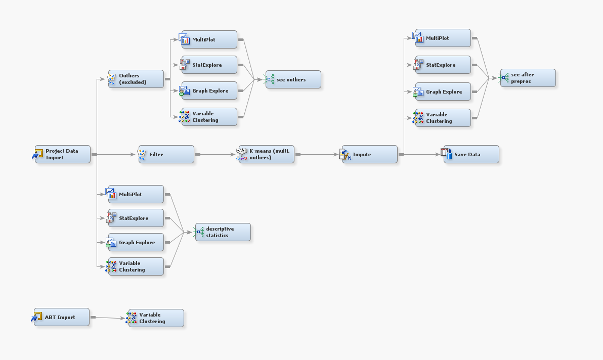
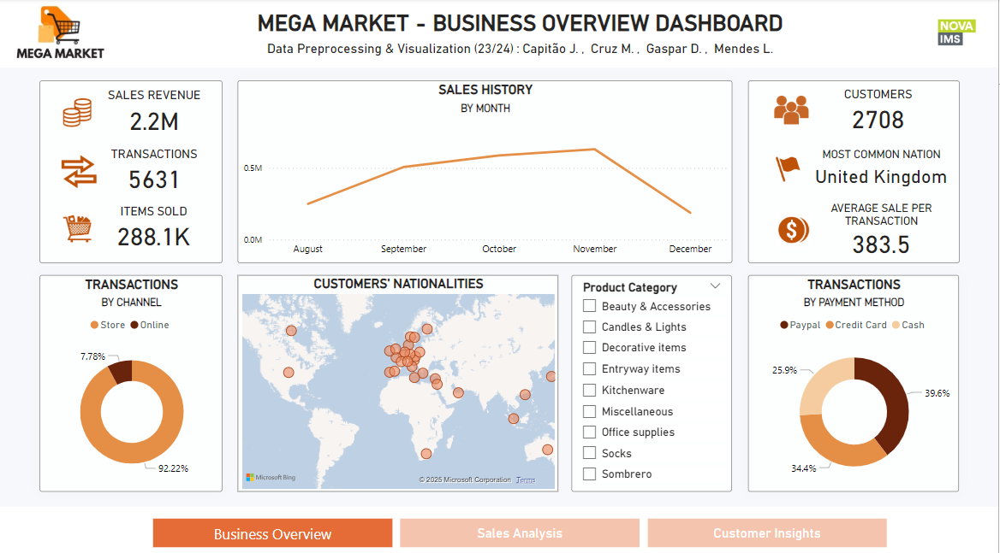
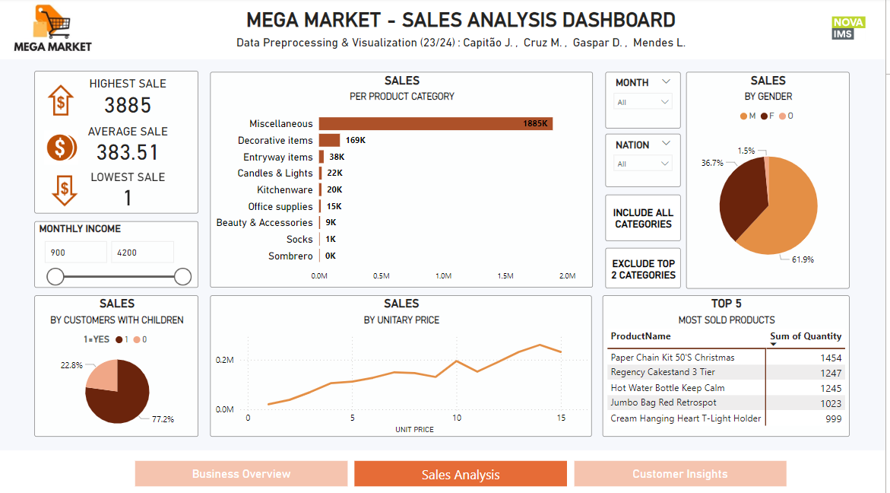
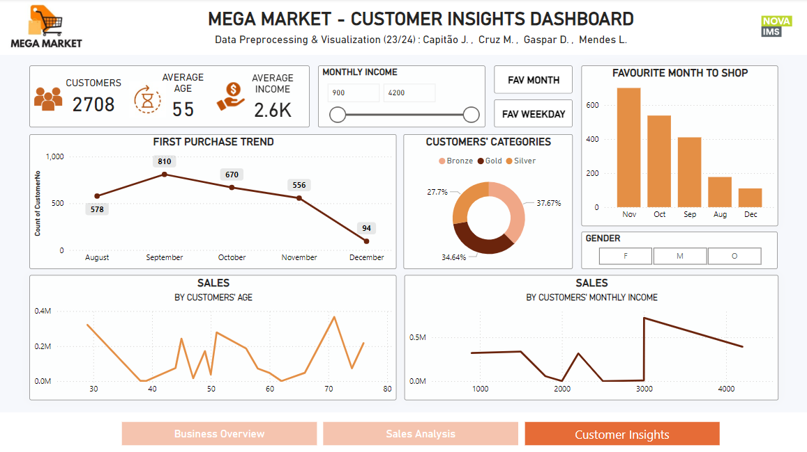

# Mega Market - Data Preprocessing and Visualization

## Project Overview
This project focuses on analyzing transactional data from Mega Market, a retail company, to develop insights into customer behavior, sales patterns, and business performance. The analysis utilized SAS and Power BI for data preprocessing, cleaning, and visualization. The results are presented through interactive dashboards covering business overview, sales analysis, and customer insights.

## Objective
The main objectives of this project were to:
1. Preprocess transactional data to create a comprehensive analytic-based table (ABT).
2. Identify insights related to customer demographics, shopping behavior, and sales trends.
3. Develop interactive Power BI dashboards for decision-making and business growth.

## Problem Statement
Mega Market lacked actionable insights into its customer base and business activity. The data, although stored in its information systems, had missing values, outliers, and inconsistencies, which limited its usability for decision-making. The goal was to process this data to derive meaningful insights and segment customers based on their behavior.

## What Was Done
### Data Preprocessing
1. **Initial Analysis**:
   - Defined variables and extracted descriptive statistics.
   - Identified missing values and outliers.
2. **Data Cleaning**:
   - Removed inconsistent or redundant data (e.g., invalid ages, duplicate information).
   - Imputed missing values using tree-based methods.
3. **Feature Engineering**:
   - Created derived variables such as transaction frequency, total amount spent, and customer categories.
   - Built an analytic-based table (ABT) summarizing each customer’s profile.

      
    *Figure: SAS Miner Diagram*

4. **Export**:
   - Exported the final preprocessed dataset for visualization in Power BI.

### Visualization in Power BI
1. **Business Overview Dashboard**:
   - Sales revenue, total transactions, items sold, and customer count.
   - Sales history, payment methods, and transaction channels.
   - Geographic distribution of customers and product categories.

      
    *Figure: Business Overview*

2. **Sales Analysis Dashboard**:
   - Sales performance by product categories, unit price, and customer demographics.
   - Insights into high-performing products and revenue-driving factors.

      
    *Figure: Sales Analysis*

3. **Customer Insights Dashboard**:
   - Customer segmentation by income, age, gender, and purchase behavior.
   - First purchase trends, preferred shopping times, and average spending patterns.

      
    *Figure: Customer Insights*

## Key Insights
- **Sales Performance**:
  - Total sales revenue of 2.2M from 5631 transactions and 288.1K items sold.
  - Most sales occurred in-store, with PayPal being the preferred payment method.
  - Miscellaneous and decorative items accounted for the majority of sales.
- **Customer Profile**:
  - Average customer age: 55 years; average monthly income: 2600.
  - Majority of customers were male, with males contributing to 61.9% of sales.
- **Behavioral Insights**:
  - Customers with lower income tend to make higher-value purchases.
  - November was the favorite shopping month, with weekends being the most preferred time to shop.

## Limitations and Recommendations
### Limitations
- The dataset only covers five months, limiting the ability to generalize insights.
- Outliers and missing values could have introduced minor biases.

### Recommendations
- Expand data collection to cover a full year to capture seasonal trends.
- Use insights to improve inventory management, marketing strategies, and customer retention.
- Consider segmentation-based marketing to target high-value customer groups more effectively.
